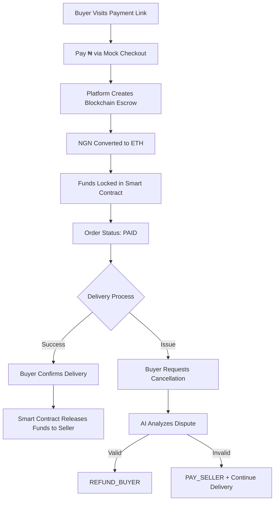

# 🔐 TrustLock - Blockchain Escrow Platform

**AI-Powered Dispute Resolution for Secure E-Commerce Transactions**

[](https://hackathon-chi-nine-19.vercel.app/)

TrustLock is a revolutionary escrow platform that combines **blockchain smart contracts** with **AI-powered dispute resolution** to create trustless, secure transactions for e-commerce in Nigeria. The platform protects both buyers and sellers while preventing frivolous order cancellations through intelligent agreement analysis.

---

## 🌐 Live Demo

🚀 **[Try TrustLock Now](https://hackathon-chi-nine-19.vercel.app/)**

Test the platform with:
- Seller registration and order creation
- Mock payment flow with blockchain escrow
- AI dispute resolution system
- Real-time order tracking

---

## 🎯 The Problem We Solve

Traditional e-commerce in Nigeria faces critical trust issues:
- **Buyers** fear paying before receiving goods
- **Sellers** fear delivering before payment confirmation
- **Disputes** are manual, slow, and biased
- **Frivolous cancellations** waste time and resources
- **No proof** of original agreements

---

## 💡 Our Solution

### **Blockchain Escrow**
Funds are locked in Ethereum smart contracts, not held by the platform. Money only releases when delivery is confirmed.

### **AI Dispute Resolution**
Intelligent analysis of agreements vs. cancellation reasons:
- Detects when buyers complain about disclosed features
- Identifies valid quality issues vs. buyer remorse
- Delivers instant, fair decisions
- Stores all disputes on blockchain for transparency

### **Smart Delivery Continuation**
**Unique Innovation:** If a buyer cancels with an invalid reason (e.g., "I don't like the red color" when agreement says "must be red"), the delivery continues and the seller still gets paid. This prevents abuse and protects sellers from frivolous cancellations.

---

## ✨ Key Features

### 🔗 **Blockchain Integration**
- **Smart Contract Escrow:** Ethereum-based fund locking
- **Sepolia Testnet:** Production-like testing environment
- **Local Hardhat:** Fast development with instant transactions
- **Automatic Conversion:** NGN to ETH for seamless UX
- **Immutable Records:** All disputes stored on-chain

### 🤖 **AI-Powered Dispute Analysis** (OpenAI GPT-4)
- **GPT-4 Integration:** Real AI analysis with OpenAI API
- **Intelligent Fallback:** Mock analysis if API key not configured
- **Term Extraction:** Identifies key terms in agreements and complaints
- **Overlap Detection:** Finds matching terms between agreement and complaint
- **Pattern Recognition:** Detects buyer remorse, valid issues, as-is sales
- **Instant Decisions:** PAY_SELLER or REFUND_BUYER in 2-4 seconds
- **Transparent Explanations:** Natural language reasoning for every decision
- **Cost Effective:** ~$0.01 per dispute analysis with GPT-4

**Example:**
```
Agreement: "Red Nike shoes, size 10, new condition"
Complaint: "I don't like the fact that they are red"

AI Decision: PAY_SELLER ✅
Reason: "red" was explicitly mentioned in agreement
Action: Delivery continues, seller gets paid
```

### 💰 **Custodial Payment Model**
- Users don't need crypto wallets
- Platform handles all blockchain complexity
- Traditional payment experience (NGN)
- Automatic gas fee management
- No crypto knowledge required

### 🚚 **Smart Delivery Flow & GPS Tracking**
- **Pre-Pickup Invalid Disputes → Delivery Continues**
- **Post-Pickup Disputes → Standard Resolution**
- **Real-Time GPS Tracking:** Live rider location on interactive map
- **Leaflet Maps:** Beautiful map interface with OpenStreetMap
- **Socket.io Updates:** Location updates every 10 seconds
- **Browser Geolocation:** No app needed, works in browser
- **Privacy-First:** Only tracks during active delivery
- QR code verification (ready for implementation)

### 🔐 **Security & Privacy**
- Encrypted wallet management
- MongoDB for user data
- Input validation on all endpoints
- Idempotency checks (prevent duplicate payments)
- Nonce management (prevent blockchain conflicts)

---

## 🛠️ Technology Stack

### **Frontend**
- **Framework:** Next.js 14 (App Router, React 18)
- **Language:** TypeScript
- **Styling:** Tailwind CSS + Custom Dark Mode Design
- **State Management:** React Hooks
- **Real-time:** Socket.io Client

### **Backend**
- **Runtime:** Node.js 18+
- **API:** Next.js API Routes (Serverless)
- **Database:** MongoDB + Mongoose ODM
- **Real-time:** Socket.io Server
- **Validation:** Zod Schemas

### **Blockchain**
- **Smart Contracts:** Solidity (Ethereum)
- **Development:** Hardhat
- **Libraries:** Viem (Modern Ethereum library)
- **Networks:** 
  - Local Hardhat (Development)
  - Sepolia Testnet (Staging)
- **Wallet Management:** Server-side custodial wallet

### **AI/ML**
- **OpenAI GPT-4:** Real AI dispute analysis
- **Intelligent Fallback:** Mock algorithm when API unavailable
- **Term Extraction:** Custom NLP for key term identification
- **Pattern Matching:** Buyer remorse, quality issues, disclaimers
- **JSON Structured Output:** Consistent, validated decisions

### **GPS & Mapping**
- **Leaflet.js:** Interactive maps with no API key required
- **OpenStreetMap:** Free map tiles
- **Browser Geolocation API:** Native GPS access
- **Real-time Updates:** Socket.io location broadcasting

---

## 🔄 How It Works

### **Complete Transaction Flow**



### **Detailed User Workflows**

#### **1. Seller Flow**
1. Register with email, phone, brand name
2. Wallet address auto-generated
3. Create order with detailed agreement
4. Share payment link with buyer
5. Monitor real-time order status
6. Receive payment on delivery confirmation

#### **2. Buyer Flow**
1. Receive payment link from seller
2. Review order details and agreement
3. Pay via mock checkout (₦ NGN)
4. Funds locked in blockchain escrow
5. Track order status in real-time
6. Confirm delivery or raise dispute
7. Funds released if delivery confirmed

#### **3. Rider Flow**
1. Register with NIN/BVN verification
2. Receive job notifications
3. Accept delivery assignments
4. Pick up from seller
5. Deliver to buyer
6. Earn delivery fee

#### **4. Dispute Resolution Flow**
1. Buyer submits cancellation with reason
2. Reason stored on blockchain (immutable)
3. AI extracts terms from agreement & complaint
4. AI detects overlap and patterns
5. Instant decision with explanation
6. **If invalid:** Delivery continues, seller paid
7. **If valid:** Order may cancel, buyer refunded

---

## 🚀 Getting Started

### **Prerequisites**
- Node.js 18+ ([Download](https://nodejs.org/))
- MongoDB ([Local](https://www.mongodb.com/try/download/community) or [Atlas](https://www.mongodb.com/cloud/atlas))
- Git

### **Installation**

```bash
# Clone the repository
git clone https://github.com/yourusername/trustlock.git
cd trustlock

# Install dependencies
npm install
```

### **Environment Configuration**

Create a `.env` file in the root directory:

```env
# Network Configuration
USE_LOCAL_HARDHAT=true          # true for local, false for Sepolia

# Database
MONGODB_URI=mongodb://localhost:27017/escrow-platform

# Blockchain (Local Development)
SERVER_WALLET_PRIVATE_KEY=0xac0974bec39a17e36ba4a6b4d238ff944bacb478cbed5efcae784d7bf4f2ff80
NEXT_PUBLIC_FACTORY_ADDRESS=0x5FbDB2315678afecb367f032d93F642f64180aa3

# OpenAI (Optional - uses mock if not set)
OPENAI_API_KEY=sk-proj-your-api-key-here

# Blockchain (Sepolia Testnet - Optional)
SEPOLIA_RPC_URL=https://eth-sepolia.g.alchemy.com/v2/YOUR_API_KEY
# Update SERVER_WALLET_PRIVATE_KEY and NEXT_PUBLIC_FACTORY_ADDRESS after deploying to Sepolia
```

### **Development Setup**

#### **Option 1: Local Hardhat (Recommended for Development)**

```bash
# Terminal 1: Start Hardhat Node
npx hardhat node

# Terminal 2: Deploy Contracts
npx hardhat run scripts/deploy.js --network localhost
# Copy the factory address to .env (NEXT_PUBLIC_FACTORY_ADDRESS)

# Terminal 3: Start Next.js
npm run dev
```

#### **Option 2: Sepolia Testnet**

```bash
# Update .env
USE_LOCAL_HARDHAT=false
SEPOLIA_RPC_URL=your_alchemy_url
SERVER_WALLET_PRIVATE_KEY=your_funded_wallet_key

# Deploy to Sepolia
npx hardhat run scripts/deploy.js --network sepolia
# Update NEXT_PUBLIC_FACTORY_ADDRESS in .env

# Start Next.js
npm run dev
```

### **Access the Platform**

Open [http://localhost:3000](http://localhost:3000) in your browser.

---

## 🧪 Testing the Platform

### **Quick 5-Minute Test**

1. **Register as Seller**
   - Navigate to `/seller/register`
   - Use test data:
     ```
     Name: Test Seller
     Email: seller@test.com
     Password: password123
     Brand: Test Store
     ```

2. **Create Order**
   - Fill in order details
   - **Important:** Set agreement to: `"It must be red, size 10"`
   - Price: `300000` (₦300,000)

3. **Process Payment**
   - Click the payment link
   - Complete mock checkout
   - Watch terminal for blockchain transaction confirmation

4. **Test Dispute AI** (Critical Feature!)
   - Navigate to order page
   - Request cancellation
   - Reason: `"I don't like the fact that it is red"`
   - **Expected:** AI says PAY_SELLER, delivery continues

### **What to Verify**

✅ **Payment Flow:**
- Only ONE blockchain transaction
- No "already known" errors
- Order status changes to PAID
- Escrow address saved

✅ **Dispute Resolution:**
- AI detects "red" in both texts
- Decision is PAY_SELLER
- Order reverts to PAID (delivery continues)
- Dispute stored on blockchain

✅ **UI Features:**
- Password visibility toggle works
- Forms validate correctly
- Real-time updates display
- No console errors

---

## 📂 Project Structure

```
trustlock/
├── contracts/                  # Solidity Smart Contracts
│   ├── Escrow.sol             # Individual escrow contract
│   └── EscrowFactory.sol      # Factory for creating escrows
├── scripts/                    # Hardhat deployment scripts
│   └── deploy.js              # Deploy contracts to network
├── src/
│   ├── app/                   # Next.js App Router
│   │   ├── api/               # Backend API routes
│   │   │   ├── auth/          # Authentication endpoints
│   │   │   ├── payment/       # Payment verification
│   │   │   └── dispute/       # Dispute & AI analysis
│   │   ├── seller/            # Seller dashboard & registration
│   │   ├── rider/             # Rider dashboard & registration
│   │   ├── order/             # Order tracking pages
│   │   ├── signin/            # Sign in page
│   │   └── mock-checkout/     # Payment interface
│   ├── lib/                   # Core utilities
│   │   ├── serverWallet.ts    # Blockchain wallet management
│   │   ├── database.ts        # MongoDB operations
│   │   ├── mongodb.ts         # Database connection
│   │   └── socketBroadcast.ts # Real-time notifications
│   └── models/                # MongoDB schemas
│       ├── User.ts            # User model
│       └── Order.ts           # Order model
├── hardhat.config.js          # Hardhat configuration
├── .env                       # Environment variables
└── README.md                  # This file
```

---

## 🎯 Key Innovations

### **1. Continue Delivery on Invalid Disputes**
Unlike traditional platforms that stop delivery when buyers cancel, TrustLock:
- Analyzes if the complaint references terms in the agreement
- Continues delivery if buyer complains about disclosed features
- Prevents sellers from losing money to frivolous cancellations
- Maintains trust in the ecosystem

### **2. On-Chain Dispute Storage**
- Every dispute reason stored on blockchain
- Immutable proof for legal purposes
- Transparent resolution process
- Verifiable on blockchain explorers

### **3. Custodial Simplicity**
- No crypto wallets needed for users
- Platform handles all blockchain complexity
- Traditional payment UX (pay in NGN)
- Gradual Web3 adoption path

### **4. Intelligent Term Matching**
- Goes beyond simple keyword matching
- Extracts meaningful terms (colors, sizes, conditions)
- Filters out common words
- Compares complaint vs. agreement intelligently

---

## 🔧 API Endpoints

### **Authentication**
- `POST /api/auth/register` - User registration (Seller/Rider)
- `POST /api/auth/signin` - User login

### **Payment**
- `GET /api/payment/verify` - Verify payment and create escrow

### **Disputes**
- `POST /api/dispute/request-cancellation` - Submit cancellation request
- `POST /api/dispute/analyze` - AI analyzes dispute with GPT-4 or mock

### **GPS Tracking**
- `POST /api/rider/update-location` - Rider sends GPS coordinates

### **Verification**
- `POST /api/verify/identity` - NIN/BVN verification for riders

---

## 🌟 Use Cases

### **Primary Target: Nigerian E-Commerce**
- Electronics marketplace
- Fashion and apparel
- Peer-to-peer sales
- Collectibles and luxury items
- Cross-city transactions

### **Why Nigeria?**
- High payment fraud rates
- Low trust in online transactions
- Growing delivery sector
- Mobile-first population
- Need for automated dispute resolution

---

## 📊 Future Enhancements

- [ ] Real payment gateway integration (Paystack/Flutterwave)
- [x] **OpenAI GPT-4 API for dispute analysis** ✅
- [x] **Real-time GPS tracking for riders** ✅
- [x] **Interactive maps with Leaflet.js** ✅
- [ ] Photo evidence upload
- [ ] Review and rating system
- [ ] Multi-signature escrow
- [ ] Mobile app (React Native)
- [ ] IPFS for document storage
- [ ] Fiat off-ramp for sellers
- [ ] Multi-currency support

---

## 🐛 Troubleshooting

### **Payment Loop Issue**
If you see multiple blockchain transactions:
- Restart dev server
- Clear browser cache/localStorage
- Check terminal for "already paid" message

### **Nonce Errors**
If blockchain transactions fail:
- Restart Hardhat node (`npx hardhat node`)
- Redeploy contracts
- Update factory address in `.env`

### **Database Connection**
If MongoDB errors occur:
- Ensure MongoDB is running
- Check `MONGODB_URI` in `.env`
- Verify database permissions

### **Network Switching**
To switch between Local and Sepolia:
- Update `USE_LOCAL_HARDHAT` in `.env`
- Restart dev server
- Check terminal for network confirmation

---

## 🤝 Contributing

We welcome contributions! To contribute:

1. Fork the repository
2. Create a feature branch (`git checkout -b feature/AmazingFeature`)
3. Commit your changes (`git commit -m 'Add some AmazingFeature'`)
4. Push to the branch (`git push origin feature/AmazingFeature`)
5. Open a Pull Request

---

## 📄 License

This project is licensed under the MIT License - see the LICENSE file for details.

---

## 🏆 Built For

**Hackathon Submission** - Showcasing:
- ✅ Blockchain integration (Ethereum/Solidity)
- ✅ AI/ML implementation (Dispute resolution)
- ✅ Full-stack development (Next.js + TypeScript)
- ✅ Database management (MongoDB)
- ✅ Real-world problem solving
- ✅ Innovative solutions (Continue delivery feature)

---

## 📞 Contact & Links

- **Live Demo:** [https://hackathon-chi-nine-19.vercel.app/](https://hackathon-chi-nine-19.vercel.app/)
- **Documentation:** See `/NETWORK_CONFIG.md` for network setup guide

---

## 🙏 Acknowledgments

- **Ethereum Foundation** - For blockchain infrastructure
- **Hardhat** - Development environment
- **Viem** - Modern Ethereum library
- **Next.js** - React framework
- **MongoDB** - Database solution

---

**Built with ❤️ for a more trustworthy e-commerce ecosystem**
